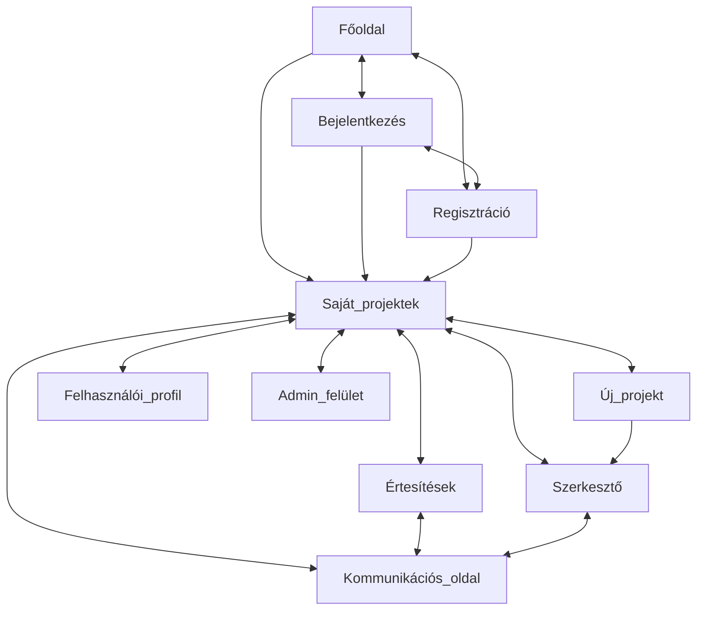
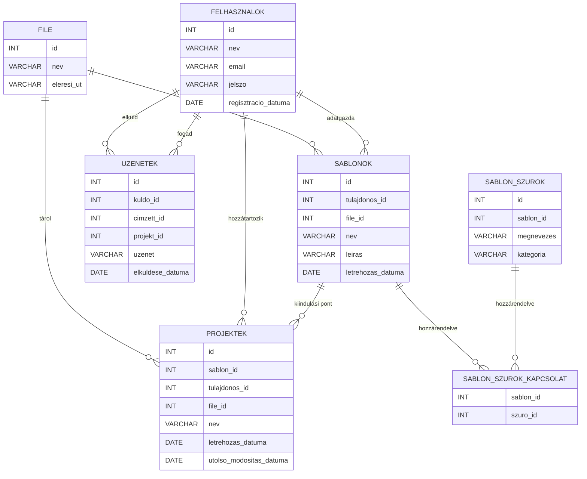

# TODO

## Larger tasks

- [x] Deploy
- [x] Basic UI Scaffold
- [x] Fix vercel build
- [x] Database stuff
- [x] Authentication
- [x] Routing
- [ ] useRef for shortcuts
- [x] Layering restructuring (Rect coordinates are in their own layer)
- [x] UseEffect separation

## Smaller tasks

## Problems

- [ ] Frame naming
- [ ] Frame creation: laggy size update

## Look into

- D&D kit
- UseImperativeHandle
- ForwardRef
- Zustand Immer
- Hono, RPC

## Features Categorized by Importance Level

### Level 1 - Absolutely Must Have

- [x] ~/editor:: basic functionality
- [x] ~/editor:: Frames
- [x] ~/editor:: Frame resizing
- [x] ~/editor:: Frame moving
- [x] ~/editor:: Move/Hand tool (+shortcut)
- [x] ~/editor:: Tooltips
- [ ] ~/editor:: Object hover
- [x] ~/editor:: Frame deleting
- [x] ~/editor:: Frame adding
- [ ] ~/editor:: Undo/Redo (+shortcut)
- [x] ~/editor:: Zoom (+shortcut)
- [ ] ~/editor:: Select multiple things at once
- [ ] ~/editor:: Copy/Paste/Cut (+shortcut)
- [x] ~/editor:: Frame content CRUD
- [x] ~/editor:: Text
- [x] ~/editor:: Image
- [x] ~/editor:: Mark elements as placeholders
- [ ] ~/editor:: Layering
- [ ] ~/editor:: Grouping
- [x] ~/editor:: Export
- [x] ~/register
- [x] ~/login
- [x] ~/profile
- [x] ~/projects
- [x] ~/projects:: load project
- [x] ~/projects/new:: list available templates
- [x] ~/projects/new:: blank template
- [ ] ~/projects/new:: load template
- [ ] ~/admin:: users, projects & templates CRUD

### Level 2 - Should Have

- [x] ~/editor:: Save
- [ ] ~/editor:: Save as template
- [ ] ~/projects/new:: filtering
- [ ] ~/editor:: Select all (+shortcut)
- [ ] ~/editor:: Duplicate (+shortcut)
- [ ] ~/editor:: Forward to template owner
- [ ] ~/editor:: Element alignment
- [ ] ~/editor:: Element opacity
- [ ] ~/editor:: Element locking
- [ ] ~/editor:: Element visibility
- [ ] ~/editor:: Element rotation
- [ ] ~/editor:: Element flipping
- [ ] ~/editor:: Element duplication
- [ ] ~/editor:: Typography
- [ ] ~/editor:: Shapes/Styles
- [ ] ~/editor:: Color picker
- [ ] ~/editor:: Selected frame on top

### Level 3 - Nice to Have

- [ ] Landing page
- [ ] ~/editor:: Frame padding & margin (Restrict element placement)
- [ ] ~/projects/new:: search
- [ ] ~/editor:: Shapes/Paths
- [ ] ~/projects:: delete
- [ ] ~/notifications
- [ ] ~/chat
- [ ] ~/editor:: Element effects
- [ ] ~/editor:: Adjustment layers
- [ ] ~/editor:: Filters
- [ ] ~/editor:: Blending modes
- [ ] ~/editor:: Custom cursors
- [ ] ~/editor:: Tooltip & Context menu custom css
- [ ] ~/editor:: Place selected frame on top
- [ ] ~/editor:: elements without frames
- [ ] ~/editor:: paste outside content

```tsx
<Stage
    style={{ cursor: tool === "hand" ? "grab" : `url(data:image/svg+xml;base64,${btoa('<svg xmlns="http://www.w3.org/2000/svg" width="24" height="24" viewBox="0 0 24 24" fill="black" stroke="white" stroke-width="1" stroke-linecap="round" stroke-linejoin="round" class="lucide lucide-mouse-pointer-2"><path d="M4.037 4.688a.495.495 0 0 1 .651-.651l16 6.5a.5.5 0 0 1-.063.947l-6.124 1.58a2 2 0 0 0-1.438 1.435l-1.579 6.126a.5.5 0 0 1-.947.063z"/></svg>')}), auto` }}
>
```

## User, data and operation types

### User types

- Normal user
- Designer user
- Admin user

### Data types

- Users
- Projects
- Templates
- Files: Custom Frame type, saved/exported to json
- Messages
- Notifications

### Operations

|               | User | Project | Template | File | Message | Notification |
| ------------- | ---- | ------- | -------- | ---- | ------- | ------------ |
| Unregistered  | C    |         |          |      |         |              |
| Normal user   | RU   | CRUD    | R        | CRUD | CR      | CRU          |
| Designer user | RU   | CRUD    | CRUD     | CRUD | CR      | CRU          |
| Admin user    | CRUD | CRUD    | CRUD     | CRUD | CRUD    | CRUD         |

## Routing



## ER Diagram


