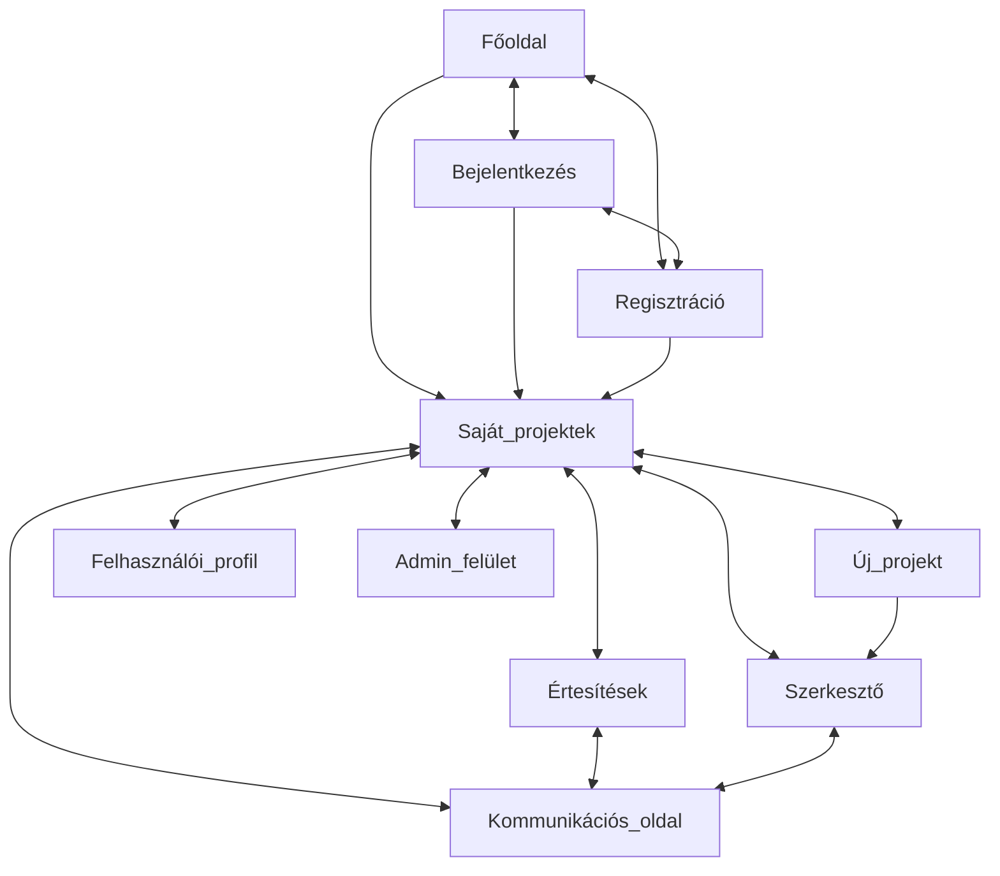
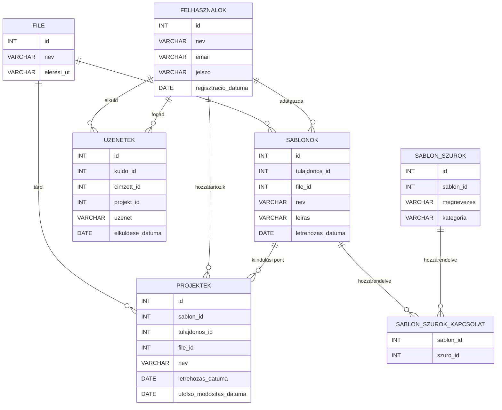

# TODO

## Larger tasks

- [x] Deploy
- [x] Basic UI Scaffold
- [x] Fix vercel build
- [ ] Database stuff
- [ ] Authentication
- [ ] Routing
- [ ] useRef for shortcuts
- [ ] Layering restructuring (Rect coordinates are in their own layer)
- [ ] UseEffect separation

## Smaller tasks

- [ ] tailwind prettier, format on save setup

## Problems

- [ ] Frame id duplication, delete problem

## Features Categorized by Importance Level

### Level 1 - Absolutely Must Have

- [ ] Landing page
- [x] ~/editor:: basic functionality
- [x] ~/editor:: Frames
- [x] ~/editor:: Frame resizing
- [x] ~/editor:: Frame moving
- [x] ~/editor:: Move/Hand tool (+shortcut)
- [x] ~/editor:: Tooltips 
- [ ] ~/editor:: Object hover
- [~] ~/editor:: Frame deleting
- [x] ~/editor:: Frame adding
- [ ] ~/editor:: Undo/Redo (+shortcut)
- [x] ~/editor:: Zoom (+shortcut)
- [ ] ~/editor:: Copy/Paste/Cut (+shortcut)
- [ ] ~/editor:: Frame content CRUD
- [ ] ~/editor:: Text
- [ ] ~/editor:: Image
- [ ] ~/editor:: Shapes/Paths
- [ ] ~/editor:: Mark elements as placeholders
- [ ] ~/editor:: Force marked elements to be used on all frames
- [ ] ~/editor:: Layering
- [ ] ~/editor:: Grouping
- [ ] ~/editor:: Save
- [ ] ~/editor:: Save as template
- [ ] ~/editor:: Export
- [ ] ~/register
- [ ] ~/login
- [ ] ~/profile
- [ ] ~/projects
- [ ] ~/projects:: load project
- [ ] ~/projects/new:: list available templates
- [ ] ~/projects/new:: blank template
- [ ] ~/projects/new:: load template
- [ ] ~/admin:: users, projects & templates CRUD

### Level 2 - Should Have

- [ ] ~/projects/new:: filtering
- [ ] ~/editor:: Select all (+shortcut)
- [ ] ~/editor:: Duplicate (+shortcut)
- [ ] ~/editor:: Forward to template owner
- [ ] ~/editor:: Element alignment
- [ ] ~/editor:: Element opacity
- [ ] ~/editor:: Element locking
- [ ] ~/editor:: Element visibility
- [ ] ~/editor:: Element rotation
- [ ] ~/editor:: Element flipping
- [ ] ~/editor:: Element duplication
- [ ] ~/editor:: Typography
- [ ] ~/editor:: Shapes/Styles
- [ ] ~/editor:: Color picker

### Level 3 - Nice to Have

- [ ] ~/editor:: Frame padding & margin (Restrict element placement)
- [ ] ~/projects/new:: search
- [ ] ~/projects:: delete
- [ ] ~/notifications
- [ ] ~/chat
- [ ] ~/editor:: Element effects
- [ ] ~/editor:: Adjustment layers
- [ ] ~/editor:: Filters
- [ ] ~/editor:: Blending modes
- [ ] ~/editor:: Custom cursors

```tsx
<Stage
    style={{ cursor: tool === "hand" ? "grab" : `url(data:image/svg+xml;base64,${btoa('<svg xmlns="http://www.w3.org/2000/svg" width="24" height="24" viewBox="0 0 24 24" fill="black" stroke="white" stroke-width="1" stroke-linecap="round" stroke-linejoin="round" class="lucide lucide-mouse-pointer-2"><path d="M4.037 4.688a.495.495 0 0 1 .651-.651l16 6.5a.5.5 0 0 1-.063.947l-6.124 1.58a2 2 0 0 0-1.438 1.435l-1.579 6.126a.5.5 0 0 1-.947.063z"/></svg>')}), auto` }}
>
```

## User, data and operation types

### User types

- Normal user
- Designer user
- Admin user

### Data types

- Users
- Projects
- Templates
- Files: Custom Frame type, saved/exported to json
- Messages
- Notifications

### Operations

|               | User | Project | Template | File | Message | Notification |
| ------------- | ---- | ------- | -------- | ---- | ------- | ------------ |
| Unregistered  | C    |         |          |      |         |              |
| Normal user   | RU   | CRUD    | R        | CRUD | CR      | CRU          |
| Designer user | RU   | CRUD    | CRUD     | CRUD | CR      | CRU          |
| Admin user    | CRUD | CRUD    | CRUD     | CRUD | CRUD    | CRUD         |

## Routing


```mermaid
graph TD;
    Főoldal <--> Bejelentkezés
    Főoldal <--> Regisztráció
    Főoldal --> Saját_projektek

    Bejelentkezés <--> Regisztráció
    Bejelentkezés --> Saját_projektek
    Regisztráció --> Saját_projektek

    Saját_projektek <--> Új_projekt
    Saját_projektek <--> Szerkesztő
    Saját_projektek <--> Értesítések
    Saját_projektek <--> Felhasználói_profil
    Saját_projektek <--> Admin_felület
    Saját_projektek <--> Kommunikációs_oldal

    Új_projekt --> Szerkesztő
    Értesítések <--> Kommunikációs_oldal
    Szerkesztő <--> Kommunikációs_oldal
```

## ER Diagram


```mermaid
erDiagram
    FELHASZNALOK {
        INT id
        VARCHAR nev
        VARCHAR email
        VARCHAR jelszo
        DATE regisztracio_datuma
    }
    SABLONOK {
        INT id
        INT tulajdonos_id
        INT file_id
        VARCHAR nev
        VARCHAR leiras
        DATE letrehozas_datuma
    }
    PROJEKTEK {
        INT id
        INT sablon_id
        INT tulajdonos_id
        INT file_id
        VARCHAR nev
        DATE letrehozas_datuma
        DATE utolso_modositas_datuma
    }
    UZENETEK {
        INT id
        INT kuldo_id
        INT cimzett_id
        INT projekt_id
        VARCHAR uzenet
        DATE elkuldese_datuma
    }
    SABLON_SZUROK {
        INT id
        INT sablon_id
        VARCHAR megnevezes
        VARCHAR kategoria
    }
    SABLON_SZUROK_KAPCSOLAT {
        INT sablon_id
        INT szuro_id
    }
    FILE {
        INT id
        VARCHAR nev
        VARCHAR eleresi_ut
    }
    FILE ||--o{ SABLONOK : "tárol"
    FILE ||--o{ PROJEKTEK : "tárol"
    SABLONOK ||--o{ SABLON_SZUROK_KAPCSOLAT : "hozzárendelve"
    SABLON_SZUROK ||--o{ SABLON_SZUROK_KAPCSOLAT : "hozzárendelve"
    FELHASZNALOK ||--o{ PROJEKTEK : "hozzátartozik"
    FELHASZNALOK ||--o{ SABLONOK : "adatgazda"
    SABLONOK ||--o{ PROJEKTEK : "kiindulási pont"
    FELHASZNALOK ||--o{ UZENETEK : "elküld"
    FELHASZNALOK ||--o{ UZENETEK : "fogad"
```
