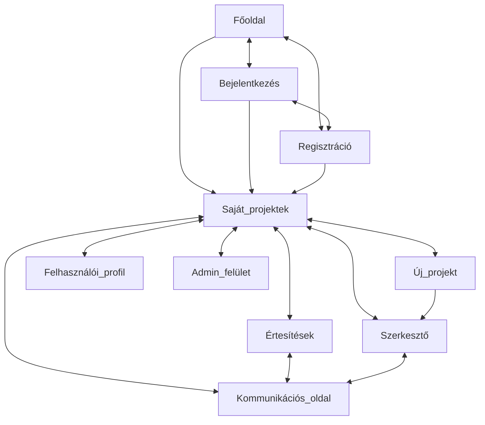
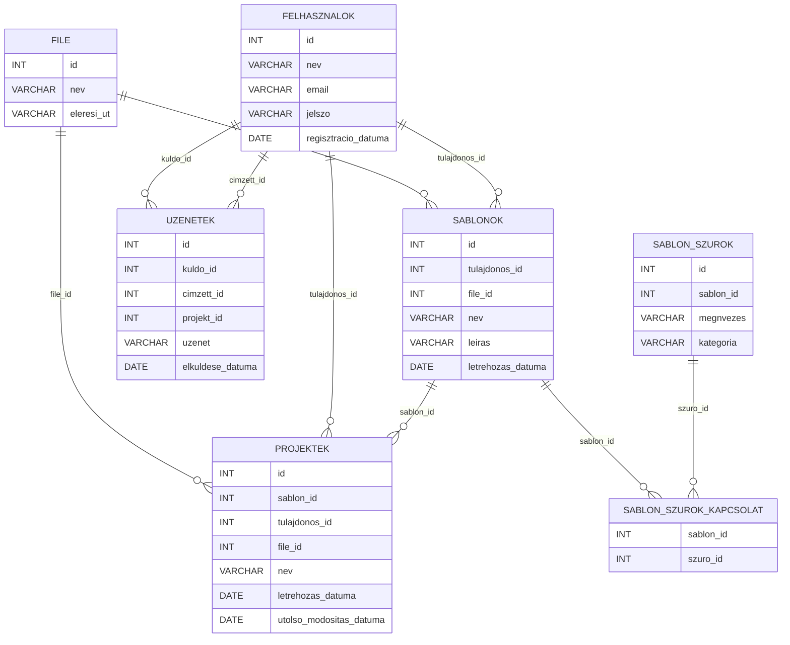

# 1. Mérföldkő

## UI - Felhasználói felület

A felhasználói felület a következő technológiákon alapszik:

- Alap oldalak: HTML, CSS, JavaScript, TypeScript, React, NextJS
- Szerkesztő felület: Canvas, KonvaJS

A felhasználói felület a következő oldalakból áll:

- Főoldal: A felhasználó köszöntése, kezdő lépések felajánlása
- Autentikációs oldalak: Bejelentkezés, regisztráció
- Felhasználói profil: Adatok áttekintése, szerkesztése
- Saját projektek: Korábban létrehozott és lementett projektek listázása
- Új projekt: Sablonok, szűrők, kereső funkciók
- Szerkesztő: Az aktuális projekt szerkesztése, a webapp fő része
- Felhasználók közötti kommunikációs oldal: A sablon tulajdonos és az alap felhasználók közötti kommunikáció
- Értesítések: Új üzenetek, TBD
- Admin felület: Felhasználók kezelése, projektek kezelése, debug funkciók

Oldaltérkép:

## DB - Adatbázis

Az adatbázis PostgreSQL-t használ Drizzle ORM-el, a következő táblákkal és kapcsolatokkal:

**Kapcsolatok:**
- Egy felhasználó több projekttel/sablonnal rendelkezhet
- Minden projekt egy sablonból indul ki, így több projekt is tartozhat egy sablonhoz
- Egy felhasználó több üzenetet küldhet és fogadhat
- Egy sablon több szűrővel rendelkezhet, egy szűrő több sablonhoz is tartozhat
- A fájlok külön táblában vannak tárolva, így egy fájl több projekthez is tartozhat (nincs szükség duplikációra módosítatlan sablonok esetén)

## BL - Üzleti logika

A használt technológiák nem objektumorientáltak, így a BL réteg nem osztályokban, hanem függvényekben és funkcionális komponensekben lesz megvalósítva.

**Fontosabb objektumok és műveleteik:**

- Felhasználó: CRUD műveletek, bejelentkezés, regisztráció, jelszóváltoztatás
- Sablon: CRUD műveletek, szűrés, keresés
- Projekt: CRUD műveletek, megosztás
- Üzenet: CR műveletek, küldés, fogadás
- Fájl: CRUD műveletek, exportálás, importálás
- Szűrő: CRUD műveletek, sablonokhoz rendelés
